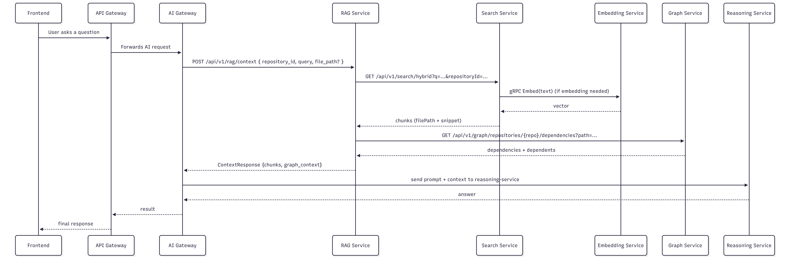

Ariadne — AI‑powered Engineering Intelligence Platform
====================================================

What this project is
--------------------
Ariadne is an engineering‑intelligence platform that combines a Java Spring Boot multi‑module backend, Python AI microservices (gRPC + FastAPI), and a React frontend to provide retrieval‑augmented developer assistance over code repositories. It integrates vector embeddings, graph context, and LLM reasoning to assemble contextual answers about code and projects.

Key implemented features
- Multi‑module Spring Boot backend declared in backend/pom.xml (modules listed: shared, api-gateway, auth-service, project-service, ingestion-service, knowledge-service, search-service, analysis-service, graph-service, ai-gateway, integration-service, scheduler-service).
- Python embedding service (gRPC) using sentence-transformers "all-MiniLM-L6-v2" and a protobuf API (ai-services/embedding-service/).
- RAG context service (FastAPI) that builds retrieval context by calling the search service and graph service (ai-services/rag-service/).
- Reasoning service (FastAPI) scaffolded to call LLM providers with environment‑driven configuration (ai-services/reasoning-service/).
- Parser service scaffold (gRPC) integrated into ai-gateway dependencies (ai-services/parser-service referenced and ai-gateway configured for gRPC).
- Local orchestration via docker-compose.yml that wires Postgres (pgvector), Redis, Kafka, Neo4j, Prometheus, Grafana, the Java services and Python AI services, plus a React frontend.
- Postgres image uses pgvector for vector storage/NN queries and an initialization SQL script (infra/postgres/init-schemas.sql).
- Inter‑service communication patterns: gRPC (embedding/parser), HTTP/REST (FastAPI & Spring controllers), and Kafka for eventing (spring-kafka dependencies present).

Stack
-----
- Languages: Java (Spring Boot) — primary backend; Python — AI microservices; TypeScript/React — frontend.
- Frameworks / runtimes: Spring Boot (Java), FastAPI (Python), gRPC (for embeddings/parser), Vite + React (frontend).
- Notable libraries/tools: sentence-transformers (all-MiniLM-L6-v2), pgvector (Postgres image), Apache Kafka (event bus), Neo4j (graph DB), Docker Compose for orchestration.

How it’s organized (top-level)
------------------------------
```
Ariadne/
├─ ai-services/                    # Python microservices: embedding, parser, rag, reasoning
│  ├─ embedding-service/
│  │  ├─ proto/embed.proto         # gRPC contract
│  │  ├─ server.py                 # gRPC server using sentence-transformers
│  │  ├─ requirements.txt
│  │  └─ Dockerfile
│  ├─ parser-service/              # gRPC parser service (Dockerfile present)
│  ├─ rag-service/
│  │  ├─ main.py                   # FastAPI RAG context endpoint
│  │  ├─ retrieval.py              # calls search/graph services
│  │  ├─ schemas.py                # pydantic request/response models
│  │  └─ Dockerfile
│  └─ reasoning-service/           # FastAPI LLM orchestration (Dockerfile present)
├─ backend/                         # Java multi-module Spring Boot project
│  ├─ pom.xml                       # parent POM listing modules
│  ├─ Dockerfile.service            # service build/run container image
│  ├─ shared/
│  ├─ api-gateway/
│  ├─ ai-gateway/
│  ├─ auth-service/
│  ├─ project-service/
│  ├─ ingestion-service/
│  ├─ knowledge-service/
│  ├─ search-service/
│  ├─ analysis-service/
│  ├─ graph-service/
│  ├─ integration-service/
│  └─ scheduler-service/
├─ frontend/                        # React + TypeScript app (Vite)
├─ infra/
│  ├─ postgres/init-schemas.sql     # DB initialization for Postgres schemas
│  └─ prometheus/prometheus.yml
├─ docker-compose.yml               # full stack orchestration
└─ README.md
```

How it fits together (runtime flow)
----------------------------------
- Frontend → API Gateway (Spring Cloud Gateway) → backend services (auth, project, search, graph, analysis, ai-gateway, ingestion).
- AI requests typically flow: Frontend → API Gateway → AI Gateway → (parser-service via gRPC) → RAG service (builds context by calling search + graph) → Reasoning service (LLM).
- Search service uses embedding-service (gRPC) to obtain vectors; vectors are intended to be stored/queried via Postgres + pgvector.
- Ingestion and other services use Kafka to publish/consume events. Neo4j is used for repository graph/dependency context.

AI workflow (implemented pieces)
--------------------------------
- Embeddings:
    - ai-services/embedding-service exposes EmbeddingService.Embed(text) via gRPC as defined in proto/embed.proto.
    - server.py loads the SentenceTransformer "all-MiniLM-L6-v2" and returns float vectors + dimensions.
- Retrieval / RAG context:
    - rag-service provides POST /api/v1/rag/context (ai-services/rag-service/main.py).
    - retrieval.fetch_hybrid_chunks calls the search service's /api/v1/search/hybrid endpoint to get ranked file snippets.
    - retrieval.fetch_graph_context queries graph-service endpoints for dependencies/dependents to augment context.
    - The RAG endpoint returns a ContextResponse containing query, chunks, and optional graph context.
- Reasoning:
    - reasoning-service is scaffolded to accept prompts and dispatch to a configured LLM provider via environment variables (OpenAI, Anthropic, or Ollama). The runtime selection and keys are environment-driven (docker-compose exposes these env variables).
- Parser:
    - parser-service is provided as a gRPC service that ai-gateway is configured to call (ai-gateway pom includes grpc-client support). The parser-service Dockerfile exists; ai-gateway expects a gRPC parser at parser-service:50051.


What to look at in the code (important files)
----------------------------------------------
- docker-compose.yml — orchestration, service wiring, env var usage, Postgres pgvector, Kafka, Neo4j, Prometheus/Grafana, optional Ollama profile.
- backend/pom.xml — parent POM listing backend modules.
- backend/Dockerfile.service — how individual Java services are built and packaged for container runs.
- ai-services/embedding-service/
    - proto/embed.proto — gRPC contract.
    - server.py — embedding implementation using sentence-transformers.
    - requirements.txt & Dockerfile — model preload and gRPC generation.
- ai-services/rag-service/
    - main.py — POST /api/v1/rag/context implementation.
    - retrieval.py — search and graph service calls.
    - schemas.py — pydantic models for request/response shape.
- infra/postgres/init-schemas.sql — DB schema initialization used by the Postgres container.
- frontend/ — React + Vite app (entrypoint and UI code).

How to run (shortest path)
--------------------------
1. Copy .env.example → .env and set required secrets:
    - JWT_SECRET (required)
    - For cloud LLMs: OPENAI_API_KEY and/or ANTHROPIC_API_KEY (if you want reasoning-service to use them)
    - Integration secrets only if you plan to enable webhooks/integrations (GITHUB_WEBHOOK_SECRET, JIRA_*)
2. Start the full stack (builds images using Dockerfiles in the repo):

   docker compose up --build

3. Notable endpoints after stack is up:
    - RAG service health: http://localhost:8000/health
    - RAG context: POST http://localhost:8000/api/v1/rag/context
    - Embedding gRPC: port 50052 (use grpcurl or a gRPC client)

Quick examples
--------------
- RAG health check

  curl http://localhost:8000/health
  # => {"status":"ok"}

- Build a RAG context (example body)

  curl -X POST http://localhost:8000/api/v1/rag/context \
  -H "Content-Type: application/json" \
  -d '{
  "repository_id": "00000000-0000-0000-0000-000000000000",
  "query": "How do I run ingestion?",
  "file_path": null
  }'

- gRPC embedding (with grpcurl)

  grpcurl -plaintext -d '{"text":"example"}' localhost:50052 Ariadne.embedding.EmbeddingService/Embed

What’s implemented vs. what to expect
-------------------------------------
Implemented and wired:
- Embedding gRPC server returns embeddings (ai-services/embedding-service).
- RAG context assembly endpoint that queries search and graph services (ai-services/rag-service).
- Docker Compose wiring for infra (Postgres with pgvector, Redis, Kafka, Neo4j), Python AI services, Java services and frontend.
- Reasoning service scaffolded and configurable for multiple LLM providers.

Notes / caveats
- Backend is a multi‑module Spring Boot project (parent POM lists modules). Some services are fully implemented; others may be scaffolds or require environment configuration to operate end‑to‑end locally.
- LLM provider keys are not included — set OPENAI_API_KEY or ANTHROPIC_API_KEY (or run the optional local Ollama container) if you want to enable reasoning with an LLM.
- The search service and many Spring services expect Postgres schemas to be initialized. The docker-compose mounts infra/postgres/init-schemas.sql for initial DB setup.
- Kafka, Neo4j and Postgres are included as containers — allocate sufficient Docker resources (CPU/memory) for a smooth local run.

## Engineering Highlights

- Designed a distributed microservice architecture using Spring Boot.
- Built AI microservices in Python with FastAPI and gRPC.
- Implemented Retrieval-Augmented Generation using vector search and graph retrieval.
- Integrated Kafka for asynchronous event processing.
- Containerized the entire platform with Docker Compose.
- Combined PostgreSQL (pgvector) and Neo4j for hybrid retrieval.

-------
License
-------
See LICENSE.md in the repository.