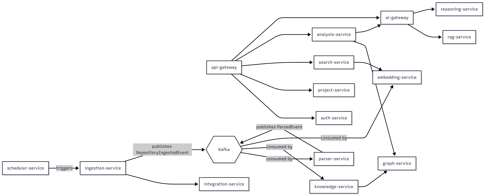

# Ariadne — Microservice Architecture

Owner: AkashBabu07

Last updated: 2026-07-25

Depends on: `overview.md`

## 1. Purpose of This Document

Section 5 of the system overview listed *capabilities* (ingestion, parsing, knowledge graph, search,
analysis, AI assistant, visualization). This document derives *service boundaries* from those
capabilities — and just as importantly, explains why each boundary sits where it does. A service
earns its own deployment unit when it has its own **reason to change**, its own **data ownership**,
and its own **scaling profile**. If a proposed service doesn't clearly have all three, it's a
candidate for folding into a neighbor instead.

 the tech-stack list
(11 backend services, 4 Python services) gets treated as the design, when really it should be the
*output* of this reasoning, not the input. We're going to derive it properly, and you'll see it
converges on very close to the same list — which is a good sign the original structure was sound,
not a coincidence.

## 2. Decomposition Method

For each capability area, we ask three questions:
1. **Who owns this data, and does anyone else need to own it too?** (data ownership test)
2. **Does this change for different reasons than its neighbors?** (rate-of-change test)
3. **Does this need to scale independently?** (scaling test)

A "yes" to at least two of three justifies a separate service. A "no" to all three means: fold it
into the service it's most coupled to.

## 3. Backend Services (Java / Spring Boot)

### 3.1 `shared`
Not a runtime service — a library module. Common DTOs, domain events, exceptions, response
envelopes, security utilities.

- **Why it exists:** without it, every service reinvents its own `ApiResponse<T>` wrapper and event
  schema, and Kafka event contracts drift out of sync between producer and consumer services.
- **Common mistake:** letting `shared` accumulate business logic. It should contain *contracts*
  (DTOs, event shapes, exceptions) — never domain logic. The moment `shared` contains an `if`
  statement deciding business behavior, it's become a hidden coupling point between services that
  should be independent.

### 3.2 `api-gateway`
Single entry point. JWT validation, routing, rate limiting, global filters, request logging.

- **Data ownership test:** owns no domain data — it's a routing/cross-cutting layer.
- **Why separate:** its rate of change (routing rules, auth policy, rate limits) is entirely
  unrelated to any domain service's rate of change. Coupling it into another service would mean
  redeploying the gateway every time, say, the Analysis Service ships a feature.
- **Future extensibility:** this is also where we will add request/response transformation,
  API versioning strategy, and circuit-breaking if a downstream service degrades.

### 3.3 `auth-service`
Registration, authentication, authorization, RBAC, JWT issuance, refresh tokens.

- **Data ownership:** owns User, Role, Permission, Session/RefreshToken entities. No other service
  should write to these tables — ever. Other services receive identity via validated JWT claims,
  not by querying auth-service's database directly.
- **Why separate:** security-sensitive code has a fundamentally different change-and-review
  profile than domain logic — you want a small, auditable surface area, not auth logic scattered
  across 10 services.
- **Common mistake:** services other services calling auth-service synchronously on every request
  to "double check" a user. Don't — validate the JWT locally (signature + claims) at the gateway
  and pass identity downstream via headers/claims. Reserve direct auth-service calls for actual
  auth operations (login, refresh, permission changes).

### 3.4 `project-service`
Organizations, Projects, Repositories (metadata, not content), Members.

- **Data ownership:** the "who owns what" system of record — which org owns which project, which
  repos belong to which project, who's a member.
- **Why separate from ingestion-service:** project-service owns *registration* of a repository
  (metadata: URL, name, settings) — a low-frequency, CRUD-shaped concern. Ingestion-service owns
  the actual *processing* of that repository's content — a high-frequency, pipeline-shaped concern.
  Different rate of change, different scaling profile (ingestion is bursty/CPU-heavy, project CRUD
  is not) — this pair is the clearest example of the decomposition method actually working.

### 3.5 `ingestion-service`
GitHub integration (via integration-service), repository cloning, metadata extraction, publishes
Kafka events to kick off parsing.

- **Why separate:** distinct scaling profile — cloning and processing large repos is I/O and
  potentially CPU heavy, bursty (triggered by webhook or schedule), and you want to scale ingestion
  workers independently of, say, search-service which is read-heavy and latency-sensitive.
- **Integration point:** publishes a `RepositoryIngestedEvent` (or similar) to Kafka. It does not
  call knowledge-service or parser-service directly — see Section 5 on event-driven boundaries.
- **`VcsProvider` abstraction:** since we're GitHub-only for v1 but want GitLab-readiness, this
  service should define a `VcsProvider` interface (fetchRepoMetadata, cloneRepo, listCommits, ...)
  with a `GitHubVcsProvider` implementation. Cheap to add now; expensive to retrofit into a
  GitHub-specific implementation later.

### 3.6 `knowledge-service`
Stores extracted engineering knowledge (entities, relationships as structured data), consumes
parser events, updates PostgreSQL and Neo4j.

- **Data ownership:** the canonical structured record of "what did we learn from parsing this
  repo" — separate from the graph traversal concern (that's graph-service's job, Section 3.8).
- **Why separate from graph-service:** knowledge-service is about *ingesting and persisting*
  extracted knowledge (write-heavy, event-driven consumer). graph-service is about *querying and
  traversing* that knowledge (read-heavy, request/response). Splitting write-path from read-path
  here is a light CQRS pattern — justified because the two have genuinely different load
  characteristics, not applied just because CQRS was on the tech-stack list.

### 3.7 `search-service`
Hybrid search — keyword + semantic + vector.

- **Why separate:** read-heavy, latency-sensitive, needs its own scaling and caching strategy
  (Redis) independent of the write-heavy ingestion/knowledge pipeline. Classic read/write split.
- **Integration point:** queries pgvector (via embedding-service's stored embeddings) and
  potentially Neo4j for hybrid graph+vector results. Does not own embedding generation — that's
  embedding-service's job (Python side).

### 3.8 `graph-service`
Neo4j APIs, graph traversal, dependency graph queries.

- **Why separate from analysis-service:** graph-service answers "what does the graph look like /
  what connects to what" (generic traversal). analysis-service answers "what does this mean for
  engineering health" (dependency analysis, impact analysis, drift, tech debt — interpretation
  built *on top of* traversal). Keeping traversal generic and analysis-specific-logic separate
  means graph-service stays reusable if you add new analysis types later without touching it.

### 3.9 `analysis-service`
Dependency analysis, impact analysis, architecture drift detection, technical debt detection.

- **Why separate:** this is where interpretation/heuristics live — a fundamentally different kind
  of logic than graph traversal or search. It changes as you refine detection heuristics, which
  happens on its own cadence independent of the underlying graph/search infrastructure.
- **Integration point:** calls graph-service for traversal, may call ai-gateway for
  reasoning-service (Python, LangGraph) when analysis requires LLM-assisted reasoning rather than
  pure graph algorithms.

### 3.10 `ai-gateway`
Spring AI. Coordinates AI workflows, communicates with Python AI services, provides unified AI APIs
to the rest of the Java backend.

- **Why separate:** isolates the Java backend from the Python AI services' protocol/deployment
  details. Other Java services never call parser-service or rag-service directly — they call
  ai-gateway, which routes to the right Python service. This means Python service internals (which
  framework, which model, how many services) can change without any other Java service noticing.
- **Common mistake:** letting individual Java services (e.g. search-service) call Python services
  directly "just this once for speed." This immediately breaks the isolation boundary and means a
  Python service change now requires auditing every Java service that might call it.

### 3.11 `integration-service`
GitHub, Slack, Jira, Email, webhook integrations.

- **Why separate:** external system integrations are unreliable, rate-limited, and independently
  versioned (per Section 4 of the system overview) — isolating them means a GitHub API change or
  outage degrades gracefully instead of taking down ingestion-service or notification delivery
  directly. This is the Anti-Corruption Layer pattern from DDD — external system quirks stop here
  and don't leak into domain services.

### 3.12 `scheduler-service`
Scheduled jobs — repository sync, cleanup, background processing.

- **Why separate:** cross-cutting concern (triggers work in other services) rather than owning
  domain data itself. Keeping it separate means schedule changes don't require redeploying the
  services being triggered.

## 4. Python AI Services

### 4.1 `parser-service`
Tree-sitter based. Parses repositories into AST-level structural representations.

- **Why Python, not Java:** Tree-sitter's mature bindings and the broader code-parsing ecosystem
  are strongest in Python. This is a deliberate polyglot boundary, not incidental — parsing is
  CPU-bound and stateless, making it a clean service to isolate by language.

### 4.2 `embedding-service`
Sentence Transformers. Chunking, embedding generation, stores to pgvector.

- **Why separate from parser-service:** different resource profile — embedding generation
  benefits from GPU/batch processing; parsing does not. Different scaling knobs.

### 4.3 `rag-service`
LangChain. Hybrid retrieval, context building, question answering.

- **Integration point:** called via ai-gateway, not directly by frontend or Java services.

### 4.4 `reasoning-service`
LangGraph. Impact analysis reasoning, architecture drift reasoning, duplicate detection — the
LLM-assisted reasoning that goes beyond what graph-service's pure traversal or analysis-service's
deterministic heuristics can do alone.

- **Why separate from rag-service:** RAG is retrieval + single-shot answer generation. LangGraph
  reasoning is multistep potentially stateful agentic workflows. Different execution model,
  different latency/cost profile — worth isolating so a long-running reasoning workflow doesn't
  block or compete with simple RAG question-answering.

## 5. Communication Patterns

This is where a lot of the actual value (and a lot of the risk) in this architecture lives, so it
gets its own document (`0event-driven.md`) — but the rule of thumb to hold in mind
while reading the service list above:

- **Synchronous (REST/Feign)**: used when the caller needs an immediate answer to proceed
  (e.g. api-gateway validating a request, ai-gateway calling rag-service for a chat response).
- **Asynchronous (Kafka events)**: used for anything pipeline-shaped, where the producer doesn't
  need to wait for the consumer (e.g. ingestion-service finishing a clone → parser-service picking
  it up → knowledge-service updating the graph). This is also what makes the pipeline resilient —
  if knowledge-service is temporarily down, ingested repos queue in Kafka instead of failing
  ingestion requests outright.

## 6. Service Interaction Diagram (high level)

---
## 8. Next Document

`docs/architecture/event-driven.md` — Kafka topic design, event schemas, ordering
and idempotency guarantees, and where synchronous vs. asynchronous boundaries are drawn in practice
(expanding on Section 5 above).