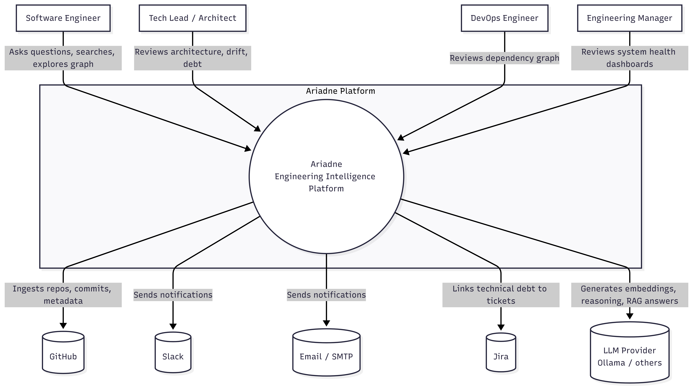

# Ariadne — System Overview

Owner: AkashBabu07
Last updated: 2026-07-25

## 1. Vision

Ariadne is an AI-powered Engineering Intelligence Platform. It continuously ingests source code,
repositories, APIs, and engineering documentation, and builds a living knowledge graph of an
organization's software ecosystem. Rather than answering questions about code in isolation, Ariadne
understands how services relate to each other, so engineers can search, visualize, and reason about
entire systems — not just individual files.

## 2. Problem Statement

As organizations grow past a handful of services, no single engineer holds the full system in their
head. Existing tools solve narrow slices of this problem: code search finds text, not relationships;
architecture diagrams go stale within weeks; AI coding assistants answer questions about one file
without knowing what depends on it. Ariadne exists to keep an always-current, queryable model of *how
the system actually fits together*, derived directly from the code and its history rather than from
documentation that drifts out of date.

## 3. Actors

| Actor | Description | Primary needs from Ariadne |
|---|---|---|
| Software Engineer | Works day-to-day in one or more services | Understand unfamiliar code, ask questions, see what depends on what before making a change |
| Technical Lead / Architect | Owns cross-service design decisions | Visualize architecture, detect drift from intended design, assess technical debt |
| DevOps Engineer | Owns build/deploy/infra | Understand service dependency graph for deployment ordering and blast-radius analysis |
| Engineering Manager | Owns delivery and planning | High-level view of technical debt and system health, not line-level code detail |

Note: these are *roles*, not necessarily separate user accounts — one person may act as more than
one actor. This distinction matters later for RBAC design in the Auth Service, but at this stage we
only care about the *needs*, not the permission model.

## 4. External Systems

Ariadne integrates with systems it does not control and must treat as unreliable, rate-limited, and
independently versioned:

| External System | Role |
|---|---|
| GitHub (initially) | Source of repositories, commits, metadata. Primary ingestion source. |
| Slack | Notification delivery, future: conversational interface |
| Jira | Future: linking technical debt / impact analysis to tracked work |
| LLM Provider(s) (Ollama initially, others later) | Embedding generation, reasoning, RAG answers |
| Email (SMTP) | Notification delivery |

**Design implication:** every external system integration must be isolated behind the
Integration Service (backend) and treated as a boundary where failures are expected and handled
gracefully — not assumed reliable. We'll formalize this as an ADR once we design that service.

## 5. System Scope

**In scope for Ariadne:**
- Ingesting repository source code and metadata
- Parsing code into structural representations (AST-level)
- Building and querying a knowledge graph of engineering entities and relationships
- Semantic and hybrid search over engineering knowledge
- Dependency analysis, impact analysis, architecture drift, and technical debt detection
- An AI assistant that answers questions grounded in the knowledge graph (RAG)
- Visualizing the graph and dashboards for repositories/projects

**Explicitly out of scope (for now — revisit later as ADRs if this changes):**
- Ariadne is not a CI/CD system — it observes and analyzes, it does not build or deploy code
- Ariadne is not a general-purpose chatbot — its AI Assistant is grounded in the knowledge graph,
  not a free-form LLM wrapper
- Ariadne does not modify source repositories — read-only ingestion only, at least through v1
- Ariadne does not replace issue trackers (Jira) — it integrates with them, not competes with them

Keeping an explicit "out of scope" list matters as much as the "in scope" list — it's what stops
scope creep from quietly turning the AI Gateway into a general chatbot, or the Ingestion Service
into a CI runner, six months from now.

## 6. System Context Diagram

## 7. Next Documents

This document establishes the boundary. The next document,
`docs/architecture/microservice.md`, will take the capabilities listed in Section 5
and map them onto the service decomposition — with the reasoning for *why* each service exists as
its own bounded context, not just a restated list of folder names.

---