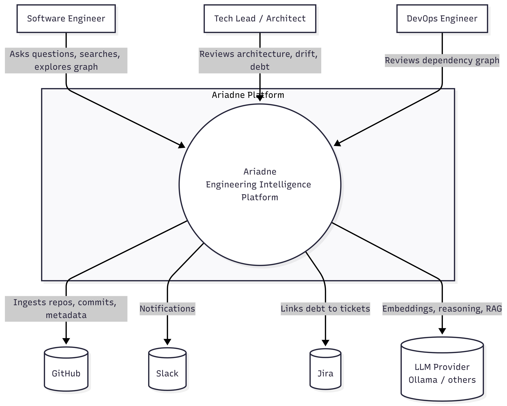
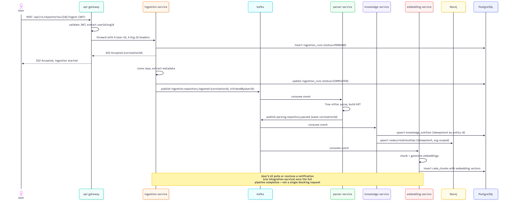
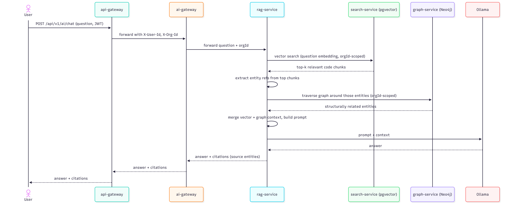
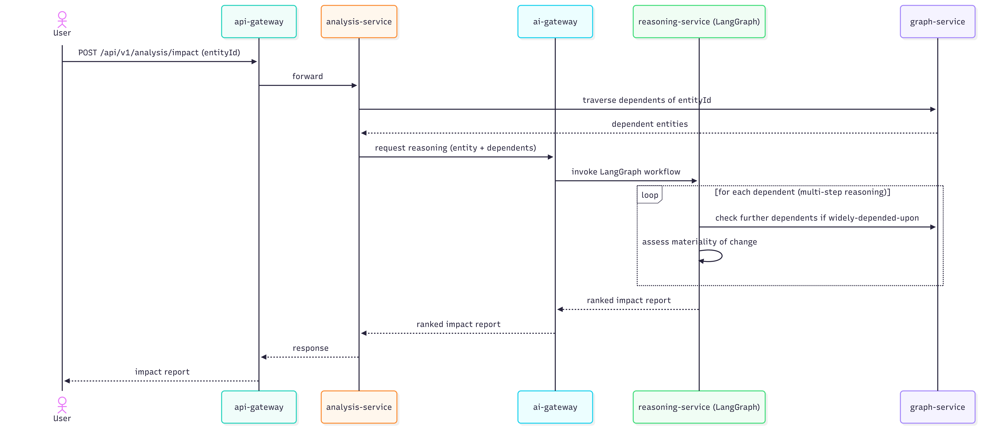

# Ariadne — Diagrams

Owner: AkashBabu07
Last updated: 2026-07-25
Depends on: `overview.md` through `api-design.md`

## 1. Purpose of This Document

Docs 01–07 each carried one diagram relevant to that document's scope. This doc consolidates them
and adds what none of them could show individually: **sequence diagrams for the key user journeys**,
tracing a single request across every layer — gateway, service, event, AI, database — so the whole
architecture reads as one system, not seven separate designs that happen to reference each other.

This is also the practical artifact for onboarding: if you bring on a collaborator later, or revisit
this project after months away, this is the doc that rebuilds the mental model fastest.

## 2. System Context (from `overview.md`)

## 3. Service Interaction (from `microservice.md`)

See `microservice.md` Section 6 for the full diagram — reproduced here for a single
browsable reference rather than duplicated in full; this doc links rather than copies where the
source diagram is already current, to avoid two copies drifting out of sync.

## 4. Sequence: User Ingests a Repository

This is the journey that most directly exercises the cross-document design — API (doc 7), events
(doc 3), security (doc 5), and database (doc 6) — all in one flow.

**What this diagram makes visible that no individual doc could:** the user gets a response in
milliseconds (the 202 Accepted), but the actual work spans four services and takes much longer,
correlated end-to-end by one `correlationId`. This is the async pipeline principle from
`event-driven.md` Section 2, shown as an actual timeline rather than a rule.

## 5. Sequence: User Asks the AI Assistant a Question

**What this diagram makes visible:** this is the hybrid retrieval from `ai-architecture.md`
Section 4, shown as an actual call sequence — specifically, that graph traversal happens *after* and
*informed by* vector search results, not in parallel and not instead of it ,Also visible: org
scoping enforced independently at both `search-service` and `graph-service` (per
`security.md` Section 4.3's defense-in-depth principle) — both calls carry `orgId`,
neither service trusts the caller to have already filtered.

## 6. Sequence: Impact Analysis Request (Reasoning Workflow)

**What this diagram makes visible:** the difference between this flow and Section 5's chat flow —
this one has a loop, potentially several graph round-trips, and is why
`ai-architecture.md` Section 5 insisted reasoning-service be a separate service from rag-service.
Looking at these two sequence diagrams side by side is a better argument for that separation than
the prose in doc 4 alone.
---

## 8. Documentation Phase: Complete

This closes docs 01–08, corresponding to steps 1–5 of your development philosophy (Architecture,
Documentation, Database Design, API Design, Diagrams). Per your stated order, the next step is
Step 6: the `shared` module — the first actual code, and the direct implementation of the contracts
defined across these eight documents (event envelope, response envelope, DTOs, error codes).

Recommend committing all eight docs as a reviewed checkpoint before starting code — this is a
natural point to read back through them once, end to end, rather than mid-implementation.